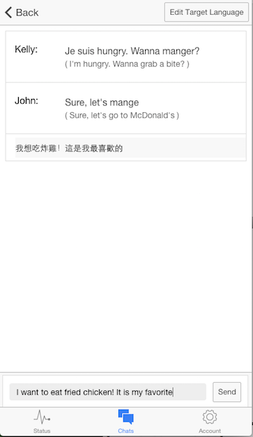
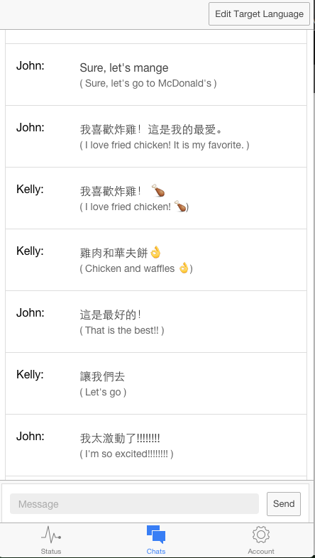
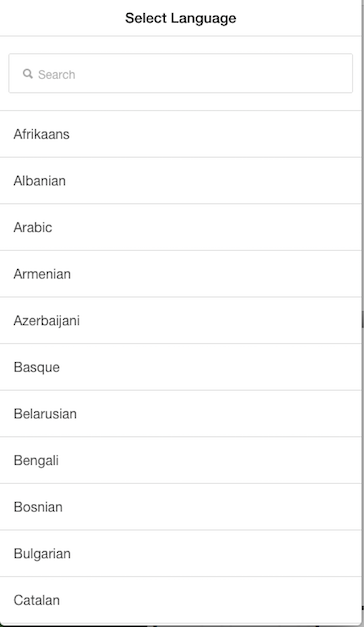
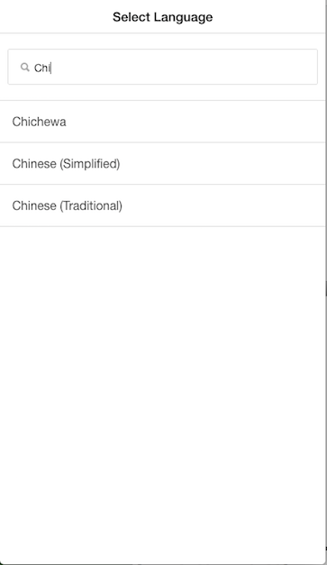
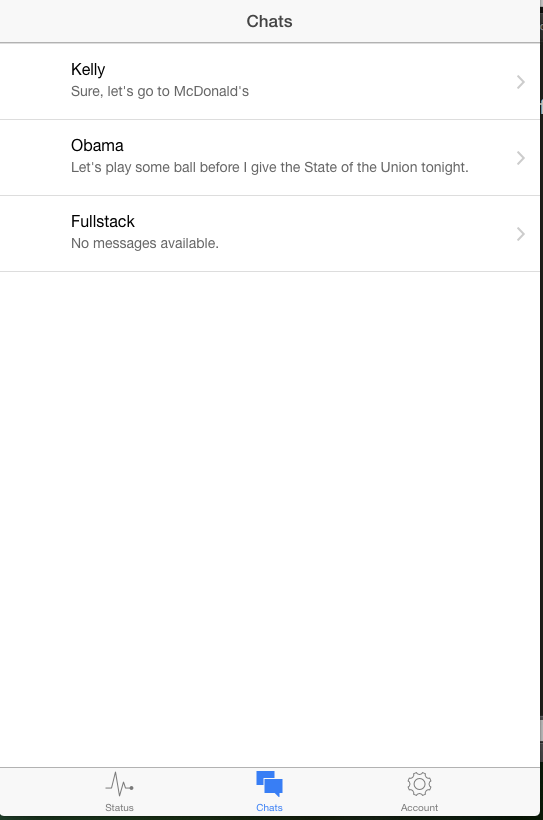

Translate Chat is a prototype of a hybrid mobile messaging app whose goal is help users overcome language barriers by translating texts as they chat in real time, catered to each recipient’s language needs. Translate Chat was created as a personal hackathon project at Fullstack Academy in NYC.

Features

- Chat view includes a live translation preview that shows texts being translated as the user types

 

- Chat view displays both the original text input by the sender and the translated text for easy comprehension

 

- Users can set individual target languages for each person with whom they chat (ie. setting texts for one friend to be translated in Spanish)

 

 

- Users can also set their desired source language for receiving texts (ie. receiving texts in Chinese)

- A 'Chats' tab contains chat list with all contacts, with preview of the most recent text for each chat

 

Technologies

- Integrates Ionic framework, Twilio, and Node/Express server to programmatically send and receive translated text messages
- Uses Firebase for real-time data storage/syncing  and Google Translate API to support translations between 90 languages
